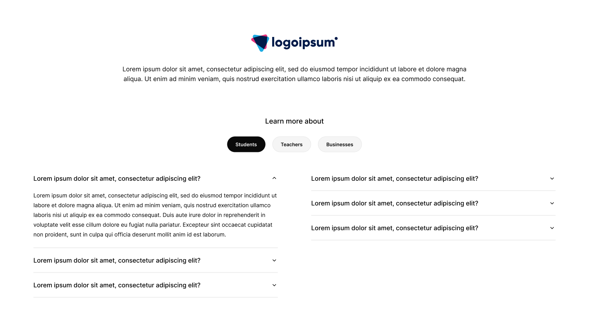

# Next.js Code Test

Welcome to the Khemistry Next.js code test!

## Instructions

- [Fork this repo](https://github.com/growthops-digital/nextjs-code-test/fork) and complete the assigment on your own copy of this repository.
- Create and implement the missing component(s) on the home page based on the supplied design below.
- Ensure that the data you supply to your component comes from the `getFAQData` function (already created for you).

## Important details

1. We follow the basics of [atomic design theory](https://atomicdesign.bradfrost.com/chapter-2/).
  - *Hint: we can see several components that make up the missing part of the page (e.g., a `Radio` [atom], `RadioGroup` [molecule], `Disclosure` [atom], and `FAQSection` [organism])*
2. We use [TailwindCSS](https://tailwindcss.com/).
3. We use [HeadlessUI](https://headlessui.com/) to ensure that all components on the page are keyboard accessible and generally follow best practices.
4. We enforce a relatively strict set of ESLint rules. Ensure you follow them and your completed project does not return any errors when running `npm run lint`.
5. We use TypeScript. Ensure you have no issues by regularly running `npm run ts:build`.
6. You're only required to build the component for desktop/large viewports (see bonus points below).
7. All the NPM packages you *might* require (note, you do not have to use them just because they're there) have been installed — do not install any others.

## Bonus points

- Follow the established practices and structures in the codebase.
- Structure your commits atomically.
  - *Hint: we use [conventional commits](https://www.conventionalcommits.org/en/v1.0.0/).*
- Use your best judgement and make the component responsive and display well on mobile, tablet, and desktop (follow a mobile-first approach).
- Add a hover state to the radio buttons.
- Add subtle touches of animation (hover, disclosure open & close, etc.)

## Design

